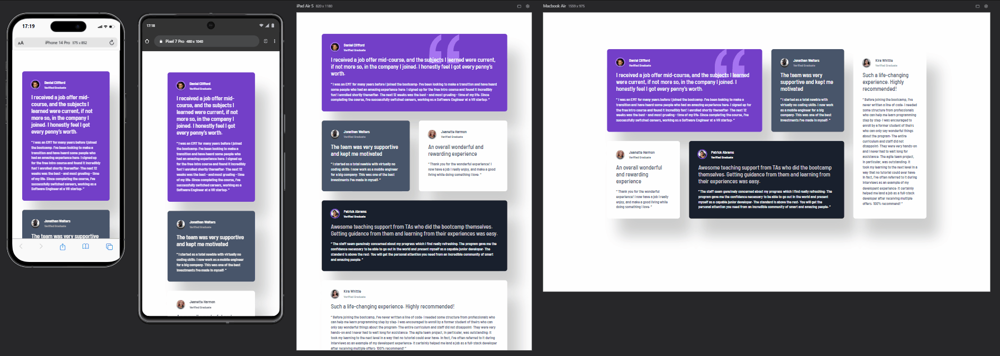

# Testimonial grid section

### Project

This is a static page application where users can:

- View the optimal layout for the site depending on their device's screen size
- See hover states for all interactive elements on the page

### Screenshot

### Links

- Live Site URL: [Testimonial grid section](https://tomduranti.github.io/testimonial_grid_section/)

### Built with

- Semantic HTML5
- Sass
- CSS Grid
- BEM
- Responsive & adaptive design
- Mobile-first workflow